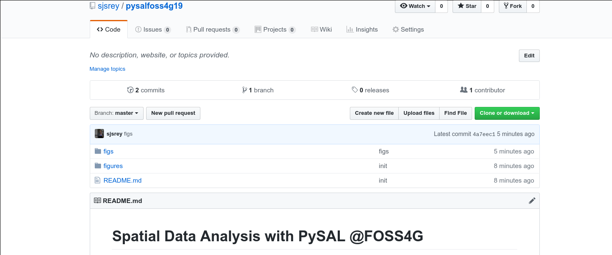
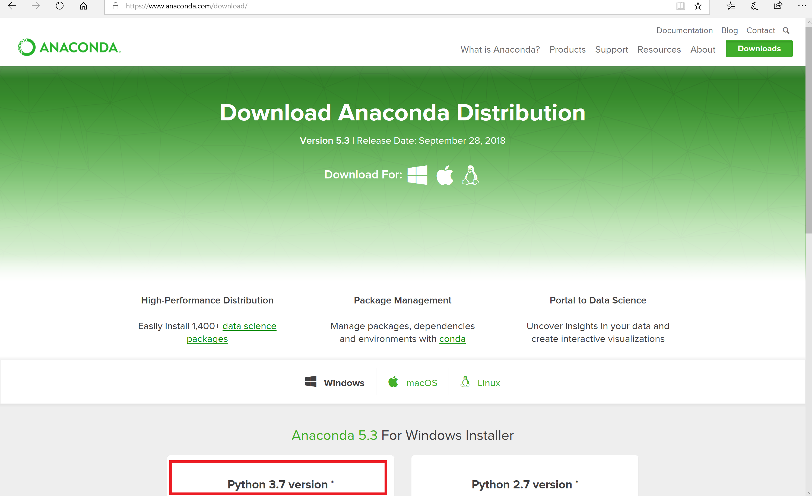
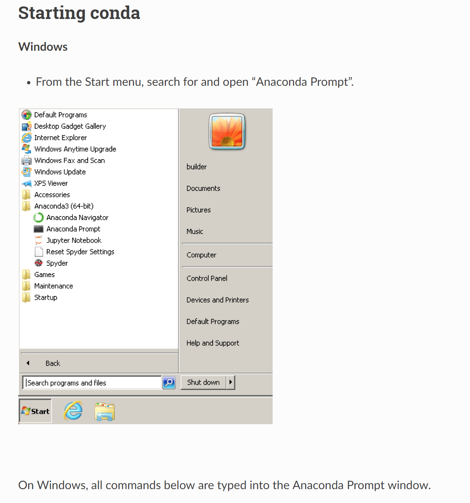
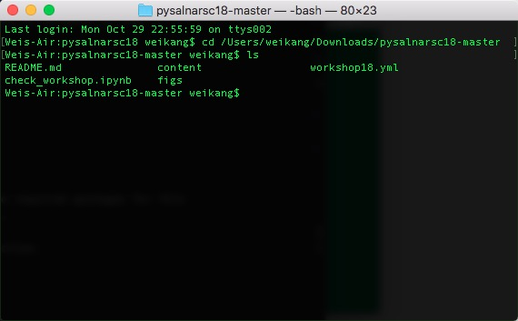
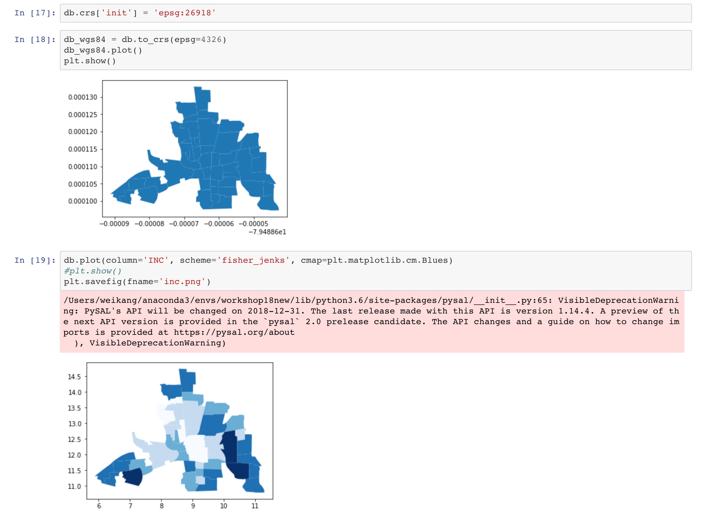
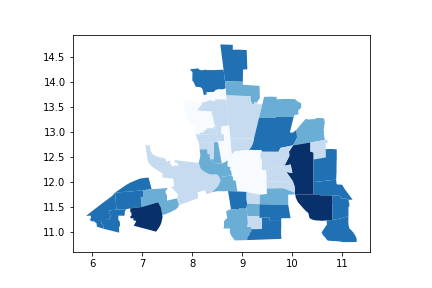

# Spatial Data Science with PySAL @SciPy20

[](https://mybinder.org/v2/gh/knaaptime/pysal-scipy20/master)

### Instructors

* [Sergio Rey](http://sergerey.org) - University of California, Riverside
* [Elijah Knaap](https:/knaaptime.com) - University of California, Riverside

---

This repository contains the materials and instructions for the PySAL workshop at [SciPy 2020](https://www.scipy2020.scipy.org/).

## Schedule (Proposed)

* 2:00-3:30
  + PySAL Overview
  + Spatial data processing
  + Choropleth mapping and geovisualization
  + Spatial weights
  + Global spatial autocorrelation
  + Local spatial autocorrelation
    - Break

* Applied Spatial Analysis: Neighborhoods

  + Clustering/Geodemographic Analysis
  + Segregation Analysis

## Obtaining Workshop Materials

If you are familiar with GitHub, you should clone or fork this GitHub repository to a specific directory. Cloning can be done by:

``` bash
git clone https://github.com/knaaptime/pysal-scipy20.git
```

If you are not using git, you can grab the workshop materials as a zip file by pointing your browser to (https://github.com/knaaptime/pysal-scipy20.git) and clicking on the green _Clone or download_ button in the upper right.



Extract the downloaded zip file to a working directory.

## Installation

We will be using a number of Python packages for geospatial analysis.

An easy way to install all of these packages is to use a Python distribution such as [Anaconda](https://www.anaconda.com/download/#macos). In this workshop we will use anaconda to build an [environment](https://conda.io/docs/user-guide/tasks/manage-environments.html) for **Python 3.6**. It does not matter which version of anaconda is downloaded. We recommend installing Anaconda 3.7.



On windows, all our work will begin from an anaconda prompt, which you can start as follows:



Start a terminal and navigate to the directory of the downloaded/ cloned materials. For example, if the materials now live in the directory `/Users/knaaptime/Downloads/pysal-scipy20` , you need to navigate to that directory from the terminal (using command `cd` ):



Once we have done that, run:

``` bash
conda env create -f environment.yml
```

This will build a conda python 3.7 environment that sandboxes the installation of the required packages for this workshop so we don't break anything in your computer's system Python (if it has one).

This may take 10-15 minutes to complete depending on the speed of your network connection.

Once this completes, you can activate the workshop environment with:


``` bash
conda activate pysal-workshop
```


``` bash
 jupyter-nbconvert --execute --ExecutePreprocessor.timeout=120 check_workshop.ipynb
```

You should see something like:

``` bash
[NbConvertApp] Converting notebook check_workshop.ipynb to html
[NbConvertApp] Executing notebook with kernel: python3
[NbConvertApp] Writing 347535 bytes to check_workshop.html
```

Open check_workshop.html in a browser, and scroll all the way down, you should see something like:



You should also see a new file in the current directory called `inc.png` that contains a map looking something line:



If you do see the above, you are ready for the tutorial. If not, please contact either of us for help.

## Troubleshooting

If you encounter the following error when starting jupyterlab:

``` bash
FileNotFoundError: [WinError 2] The system cannot find the file specified
```

A solution is to issue the following command in the anaconda prompt:

``` bash
 python -m ipykernel install --user
```

